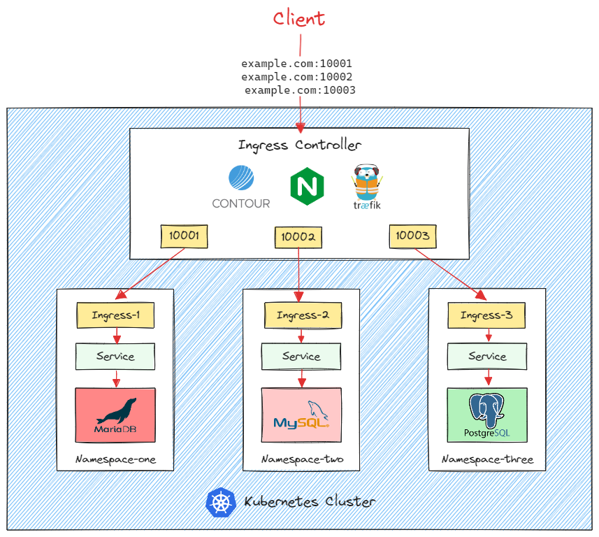

# K8S Ingress for TCP Services 🔱

  

### What is a Kubernetes Ingress? 
A `Kubernetes Ingress` is an API object that shows how traffic from the internet should reach internal Kubernetes cluster Services that send requests to groups of Pods. It is a `configuration request` for the `ingress controller` that allows the user to define how external clients are routed to a cluster’s internal Services.

### What is a Kubernetes ingress controller?
An `ingress controller` acts as a `reverse proxy` and `load balancer`. It converts configurations from Ingress resources into routing rules that reverse proxies can recognize and implement.

## Get started
Choose what third party projects to use for ingress controller. Look for `readme.md` file in each project folders.